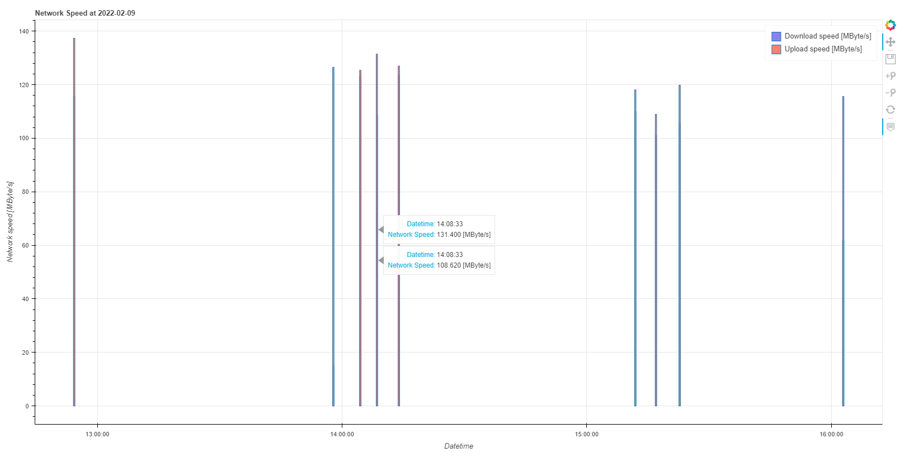

# 出力データ

## 出力ファイル

| 名称                   | 形式 | ファイル名の例          | 備考                                            |
| ---------------------- | ---- | ----------------------- | ----------------------------------------------- |
| 計測データ記録ファイル | csv  | yyyy-MM-dd_fastcom.csv  | yyyy には西暦年、MM には月、dd には日を入れる。 |
| 計測レポートファイル   | html | yyyy-MM-dd_fastcom.html | yyyy には西暦年、MM には月、dd には日を入れる。 |

### 計測データ記録ファイル

| 名称             | 内容                                   | 備考                                                                                                                           |
| ---------------- | -------------------------------------- | ------------------------------------------------------------------------------------------------------------------------------ |
| 計測日時         | 計測開始した日時。                     | yyyy-MM-dd HH:mm:ss で記録。 yyyy には西暦年、MM には月、dd には日、HH には時間（24 時間表記）、mm には分、ss には秒を入れる。 |
| ダウンロード速度 | 計測日時で計測できたダウンロード速度。 | 基本単位は [Bit/s] とし、小数点第二位までとする。オーダーや [byte/s] についてはオプションで変更可能とする。                    |
| アップロード速度 | 計測日時で計測できたアップロード速度。 | 基本単位は [Bit/s] とし、小数点第二位までとする。オーダーや [byte/s] についてはオプションで変更可能とする。                    |

計測データは下記のように記録する。

```csv
"計測日時", "ダウンロード速度 [bit/s]", "アップロード速度 [bit/s]"
"2022-02-16 09:00:00", "198.39", "71.22"
"2022-02-16 09:30:00", "30.36", "157.75"
"2022-02-16 10:00:00", "176.85", "194.42"
"2022-02-16 10:30:00", "9.08", "8.25"
"2022-02-16 11:00:00", "77.23", "165.54"
"2022-02-16 11:30:00", "93.21", "24.84"
```

## 計測レポートファイル

データ可視化モジュール `bokeh` を利用し、前日もしくは指定日のデータをグラフ化する。\
出力は `html` とし、そこから `png` での保存とする。



グラフには下記を表示する。

-   グラフタイトル: Network speed at yyyy-MM-dd
    -   yyyy: 西暦年
    -   MM: 月
    -   dd: 日
-   計測日時（X 軸）
-   ネットワーク速度（Y 軸）
-   ダウンロード速度（棒グラフ）
-   アップロード速度（棒グラフ）
-   凡例
-   ツールバー

ツールバーには下記を表示する。

-   `bokeh` サイトへのリンク（外せない）
-   Pan
-   Save
-   Zoom In
-   Zoom Out
-   Reset
-   Hover

グラフへカーソルをホバーした際には下記を表示する。

-   日時
-   ネットワーク速度
